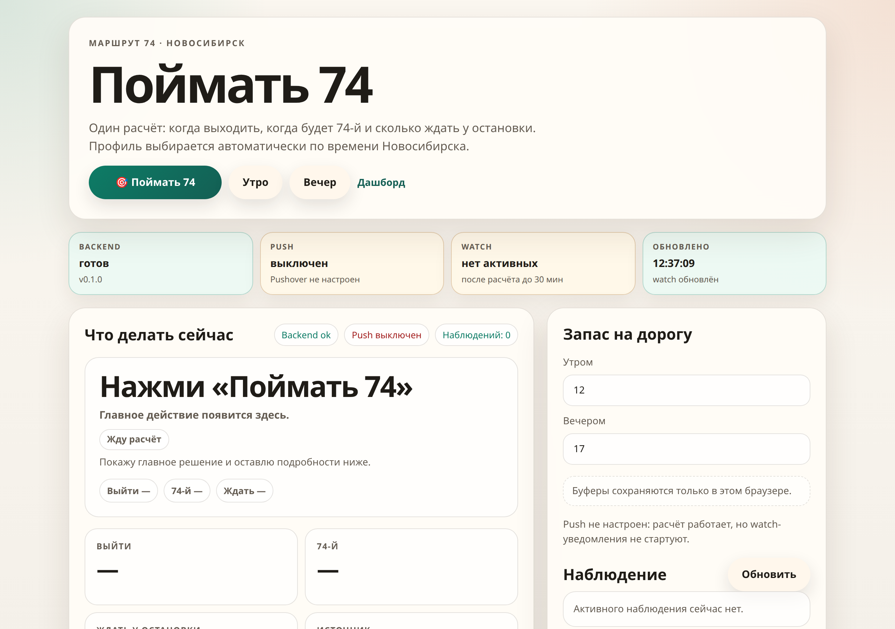

# Route 74 Monitor

[](https://github.com/vtestah/route-74-monitor/actions/workflows/ci.yml)
[](https://github.com/vtestah/route-74-monitor/actions/workflows/release.yml)
[](LICENSE)


A personal web app that answers one question: when do I leave to catch minibus
route 74 in Novosibirsk? The main flow is a single browser button,
`🎯 Поймать 74` ("Catch the 74"). It reads a live ETA from Yandex Maps, falls
back to local Yandex history when needed, and shows `no ETA` honestly when there
is no signal. Early and final alerts can go out over Pushover, and the runtime
works fine without it.



## At a glance

- Runtime: Python 3.11+, FastAPI, SQLite.
- Source order: Yandex live -> Yandex history -> no ETA.
- One-button UX: `🎯 Поймать 74` in the browser.
- Safety buffers: 12 minutes in the morning, 17 in the evening.
- The live source lives only in `src/route74/sources/yandex/`.
- Pushover is optional: `PUSHOVER_APP_TOKEN`, `PUSHOVER_USER_KEY`.
- Data: `data/route74.sqlite`, `data/web_watches.json`.
- Secrets stay in `.env` and never in git.

## Quick start

```bash
git clone https://github.com/vtestah/route-74-monitor
cd route-74-monitor
./bin/onboard
```

Open `.env`, add Pushover keys if you want them, then run `route74-web` (or
`./bin/web` if the launcher is not installed). A CLI preview works without the
web server: `.venv/bin/route74 commute morning`.

Other useful entry points: `./bin/smoke-web-local` for a local web-runtime
smoke check, `./bin/dashboard` for the operator dashboard.

## User flow

- The main screen shows the `🎯 Поймать 74` button; a status strip above it
  covers backend, Push, active watches, and the last update time.
- The app picks `morning` or `evening` automatically from Novosibirsk time.
- The answer stays catch-first: what to do now, when to leave, when the 74
  arrives, and how long to wait at the stop, with reliability and source
  detail below the action, not above it. The missed case is blunt on purpose.
- Each request opens a watch for a limited time; early and final "leave now"
  signals go out as single Pushover messages when the notifier is configured.
  Without Pushover, the watches and the web UI keep working.
- Morning and evening buffers set in the browser live in `localStorage` only,
  never in git or on the server.

Two profiles, chosen by local time:

| Profile | Window | Buffer |
| --- | --- | --- |
| `morning` | `06:00-10:59` | 12 min |
| `evening` | `17:00-22:59` | 17 min |

## Architecture

- `src/route74/domain/` holds domain data and rules.
- `src/route74/services/` does snapshot collection and the decision.
- `src/route74/presenters/` turns that into human-readable text.
- `src/route74/web/` is the FastAPI app, HTML UI, and watch runtime.
- `src/route74/notifications/` is the notifier interface plus the Pushover adapter.
- `src/route74/storage/` is the SQLite schema, health, and reporting.
- `src/route74/sources/yandex/` is the live and history integration.
- `src/route74/cli/` holds diagnostic commands and a smoke-friendly preview.

## Pushover

Minimal setup:

```text
PUSHOVER_APP_TOKEN=
PUSHOVER_USER_KEY=
```

If either key is missing, a no-op notifier is used. The web app does not crash,
it just skips push notifications.

## Web config

```text
ROUTE74_WEB_HOST=127.0.0.1        # 0.0.0.0 to bind beyond loopback
ROUTE74_WEB_PORT=8074
ROUTE74_WEB_ALLOW_PUBLIC=0        # must be 1 for a non-loopback host
ROUTE74_WEB_WATCH_STATE_PATH=data/web_watches.json
ROUTE74_DB_PATH=data/route74.sqlite
```

The simplest external access without a domain or reverse proxy is
`ROUTE74_WEB_HOST=0.0.0.0` with `ROUTE74_WEB_ALLOW_PUBLIC=1`, served at
`http://<server-ip>:8074/`. That is plain HTTP with no TLS and no auth, so it
only fits closed personal use.

## CLI

`commute` and `predict` print the same user flow without the web UI:

```bash
route74 commute morning
route74 stats morning
route74 forecast-health
route74 watch-state
```

Full command list, including the prediction lab and maintenance commands:
[docs/CLI.md](./docs/CLI.md).

## ETA decision

The algorithm keeps the `Yandex live -> Yandex history -> no ETA` order and
ships a machine-readable reason code next to the chosen ETA, from a direct
live ETA down to a risk-adjusted fallback or an honest `no_eta`. Full list of
codes: [docs/CLI.md](./docs/CLI.md#eta-decision-reason-codes).

## Testing

Tests run with pytest and gate CI on every push.

- `tests/test_smoke_suite.py` is a discovery bridge: it turns the in-package
  `route74.smoke.*` modules into individual pytest cases, so the whole smoke
  suite (over 80 modules) reports at pytest granularity.
- Focused unit tests live in `tests/`, for example the dashboard data layer.
- Ruff handles lint and format. CI runs `ruff check`, `ruff format --check`, and
  `pytest` with coverage.

```bash
pip install -e ".[test,yandex]"
pytest
```

There is also a local `./bin/check`, running shell linting, the smoke package,
and drift checks in one pass, plus focused scripts like `./bin/smoke-yandex`
and `./bin/package-smoke`.

CI workflow: [.github/workflows/ci.yml](.github/workflows/ci.yml).

## Docs

- [docs/README.md](./docs/README.md): index.
- [docs/CLI.md](./docs/CLI.md): full command reference and ETA reason codes.
- [docs/QUALITY.md](./docs/QUALITY.md): checks.
- [docs/SECURITY.md](./docs/SECURITY.md): `.env`, secrets, deploy hygiene.
- [docs/RUNBOOK.md](./docs/RUNBOOK.md): diagnostics.
- [docs/SERVER_DEPLOY.md](./docs/SERVER_DEPLOY.md): server run.
- [docs/REPORTING.md](./docs/REPORTING.md): forecast and reporting layer.
- [docs/DECISIONS.md](./docs/DECISIONS.md): recorded decisions.

## Invariants

- No official/gortrans fallback without a fresh decision.
- No `.env`, tokens, user keys, or real SQLite/JSON data in git.
- No exact personal addresses, floors, or work locations in docs or code.
- Business logic stays in `domain/services/presenters`, not in web or notifier.
